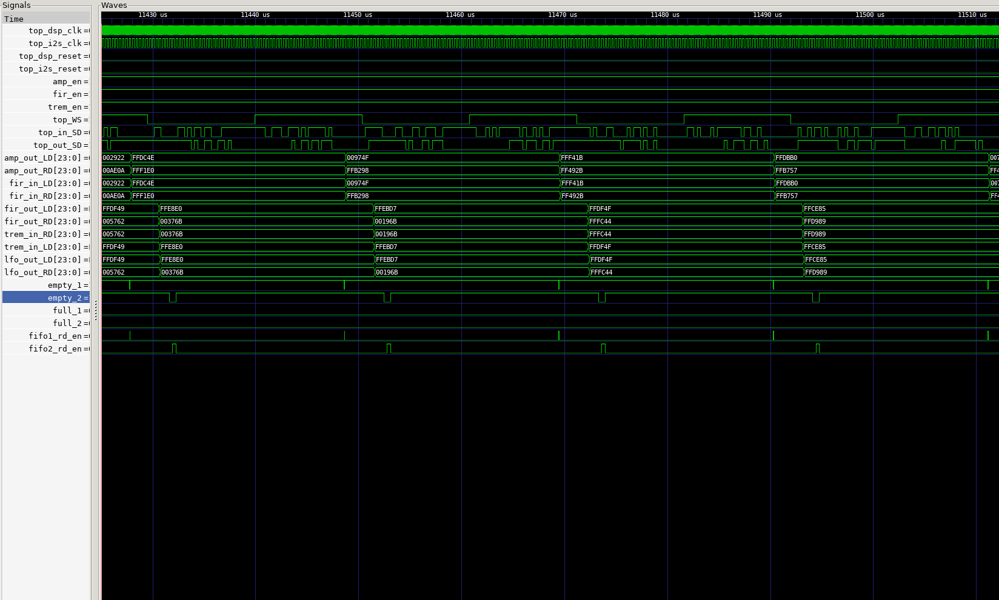
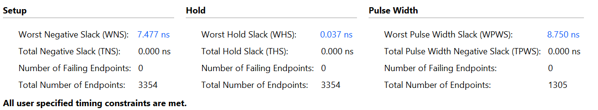
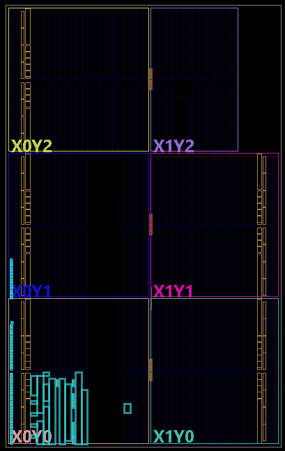

# FPGA Audio DSP Chain
[](https://github.com/minhdungtran/fpga-audio-dsp-chain/actions/workflows/CI.yml)

A digital audio effects pipeline implemented in RTL, verified in simulation, and synthesized
for Artix-7 FPGA . Audio comes in over I2S, passes through a
gain stage, an FIR filter, and a tremolo effect, and goes back out over I2S.

## Author

**Author:** Tran Minh Dung  
**HDL:** Verilog  
**Verification:** Cocotb  
**Synthesis:** Vivado

## Signal Chain

```
I2S RX → FIFO → Amp → FIR Filter → Tremolo (LFO + Amp) → Async FIFO → I2S TX
```

## Clock Domains

The design spans two independent, asynchronous clock domains, crossed via the async FIFO at the
DSP → I2S TX boundary:

| Clock | Period | Frequency | Domain |
|---|---|---|---|
| `dsp_clk` | 20.000 ns | 50 MHz | RTL processing (Amp, FIR, Tremolo) |
| `i2s_clk` | 325.520 ns | ≈3.072 MHz | I2S bit clock (RX/TX) |

Constrained in [`constraints/timing_constraint.xdc`](constraints/timing_constraint.xdc), with
`set_clock_groups -asynchronous` declared between the two. At 32-bit stereo slots, the I2S bit
clock corresponds to a ≈48 kHz audio sample rate.

> **Scope note:** this project is currently verified through simulation and carried through
> synthesis/implementation for timing closure only — no physical FPGA board yet. Accordingly,
> `timing_constraint.xdc` defines clocks only; I/O pin constraints will be added once hardware
> is available to generate a real bitstream.

## Features

- **I2S receiver (`I2S_rv`)** — standard I2S timing, MSB-first, one `WS`-clock frame-sync delay
- **I2S transmitter (`I2S_TX`)** — serializes stereo samples back out on `SD`, MSB-first, with double-buffered sample loading so a new frame is always ready when `WS` switches channels
- **Synchronous FIFO** — buffers samples between I2S and processing clock domains
- **Amplifier (`Amplifier`)** — signed Q2.14 fixed-point gain with saturation
- **FIR filter (`FIR`)** — 63-tap stereo low-pass filter, time-multiplexed over a single shared MAC datapath
- **Tremolo (`tremolo_lfo` + `Amplifier`)** — an LFO computes a time-varying gain, which drives a second amplifier stage to modulate volume
- **Asynchronous FIFO** — clock-domain crossing back to the I2S TX clock domain
- **Configurable effect chain** — top-level `amp_en` / `fir_en` / `trem_en` controls let each stage be independently bypassed or reconfigured at runtime
- **Fully verified** — unit tests per module plus full-chain integration tests (see `tb/`)

## Repository Structure

```
.
├── .github/
│   └── workflows/
│       └── cocotb-tests.yml   # CI: runs every testbench on push/PR
├── coefficients/          # FIR filter coefficient files (.mem) and generation script
│   ├── fir_8khz_63tap_q15.mem
│   └── FIR_coefficient.py
├── constraints/           # Vivado timing constraints
│   └── timing_constraint.xdc
├── docs/                  # Simulation and synthesis / implementation evidence
│   ├── implemented_design.png
│   ├── timing_summary.png
│   ├── utilization_report.txt
│   └── dsp_waveform.png
├── fpga/
│   ├── DSP.xpr              # Vivado project file
│   ├── rtl/                # Synthesizable RTL
│   │   ├── effects/          # Tremolo / audio effect modules
│   │   ├── fifo/               # Synchronous FIFO
│   │   ├── fifo_integration/
│   │   ├── i2s/                  # I2S receiver / transmitter
│   │   └── top/                    # Top-level integration
│   └── tb/                 # Testbenches
│       ├── integration/      # Full-pipeline / system-level tests
│       │   ├── Audio_Passthrough/
│       │   ├── dsp_amp/
│       │   ├── dsp_chain/
│       │   ├── dsp_fir/
│       │   ├── dsp_tremolo/
│       │   ├── fir_tx/
│       │   └── rv_fir/
│       └── unit/            # Per-module unit tests
├── .gitignore
├── requirements.txt        # cocotb + numpy, pinned to match local versions
└── README.md
```

## Module Documentation

### I2S_rv — I2S Receiver
Standard I2S receiver for one stereo audio frame, sampling `SD` on the rising edge of `sck`.

- A transition on `WS` marks the start of a new channel slot, with a 1-`sck` delay at the
  start of each slot for frame synchronization (standard I2S: MSB appears one bit-clock after
  the `WS` edge).
- After the delay, `WIDTH` serial bits are shifted in MSB-first.
- Left and right channel data are captured into internal shift registers; once both channels
  have arrived, they are copied to `output_LD` / `output_RD`.
- `data_ready` pulses for one `sck` cycle when a complete stereo frame is available; outputs
  hold their value until the next complete frame.

### I2S_TX — I2S Transmitter
Serializes parallel stereo samples onto `SD`, shifting on the falling edge of `sck` (opposite
edge from the receiver, as required by the I2S protocol), with `WS` selecting the active channel.

- Same 1-`WS`-clock frame-sync delay as the receiver.
- When `data_valid` is asserted, `input_LD` / `input_RD` are latched into `pending_LD` /
  `pending_RD`; `pending_valid` pulses high until the pending sample is moved into the transmit
  shift registers.
- On the `Prev_WS = 1 → WS = 0` edge (start of a new WS cycle), `pending_LD` / `pending_RD` are
  loaded into `reg_LD` / `reg_RD` and shifted out MSB-first for `WIDTH` bit-clocks.
- `reset` clears all internal registers, counters, and the serial output.

### FIR — 63-Tap Stereo FIR Filter
Time-multiplexed FIR low-pass filter: separate circular sample buffers per channel, one shared
MAC datapath.

- On `data_valid`, one signed 24-bit L/R frame is stored into the circular buffers; the module
  then runs all 63 taps for the left channel, then all 63 for the right.
- **Arithmetic:** 24-bit signed samples, Q1.15 signed 16-bit coefficients (loaded from a memory
  file), 48-bit accumulator; final result is rounded, shifted right by 15, and saturated back
  to 24 bits.
- **Pipeline states:** `CLEAR` (zero buffers after reset) → `IDLE/STORE` (capture new frame) →
  `MAC` (one multiply-accumulate per clock) → `ROUND/SCALE/SAT` (convert accumulator back to
  24-bit audio) → `DONE` (latch each channel result, pulse `data_ready` once both are valid).
- Left/right channels have independent sample histories but share the coefficient ROM,
  multiplier, accumulator, and output logic.

### Amplifier — Fixed-Point Stereo Gain
Multiplies signed PCM samples by a signed Q2.14 fixed-point gain `G` (`gain_real = G / 2^14`).

- On `data_valid`, `in_LD` / `in_RD` are captured and multiplied by `G`.
- The product is arithmetically shifted right by 14 bits to rescale back to normal PCM, then
  saturated to the valid signed `WIDTH`-bit range (saturation is checked *after* the shift, not
  right after the multiply).
- `data_ready` pulses for one `sck` cycle when `out_LD` / `out_RD` hold a valid frame; outputs
  hold until the next frame completes.
- Non-negative gain = normal volume control; negative gain is valid but inverts waveform
  polarity — this dual role is what lets the same block double as the tremolo's modulation stage.

### tremolo_lfo — Tremolo Low-Frequency Oscillator
Generates a time-varying, unipolar sine gain multiplier and hands it off to a downstream
`Amplifier` instance, which is what actually applies the volume modulation — together the two
blocks form the tremolo effect.

- **LFO:** 16-bit phase accumulator, incremented by `control_rate` per valid audio frame; the
  upper 8 bits index a 256-word ROM of a unipolar sine wave in U0.14 format.
- **Depth:** `control_depth` is an unsigned U0.14 fraction controlling effect intensity.
- **4-stage pipeline**, advancing on `data_valid`:
  1. `data_valid` — capture `in_LD`/`in_RD`, step the phase accumulator
  2. `multi_D` — multiply the U0.14 ROM value by U0.14 `control_depth`
  3. `shift_D` — truncate the 28-bit product back to U0.14
  4. `subtract` — subtract the depth-scaled LFO value from digital 1.0 to produce
     `tremolo_gain`
- `out_LD` / `out_RD` output the original audio, delayed to match the 4-cycle pipeline so
  audio and gain stay synchronized.
- `data_ready` pulses for one `sck` cycle once the synchronized audio and `tremolo_gain` are
  ready to feed the downstream `Amplifier`.

## Verification

All testbenches are written in [cocotb](https://www.cocotb.org/). Modules with numeric behavior
(FIR, Amplifier, LFO, and the full DSP chain) are checked bit-exact against Python golden models
— the FIR model even loads the same `.mem` coefficient file used in synthesis, so the testbench
and the hardware are guaranteed to agree on coefficients.

### Unit Tests (`tb/unit/`)

**`i2s_rv` — I2S Receiver**
- Edge-case frames (silence, all-ones, alternating bits, sign boundary, LSB-only) plus 100
  randomized stereo frames, checked against the transmitted bitstream.
- Confirms `data_ready` pulses for exactly one clock and outputs hold stable until the next frame.

**`i2s_tx` — I2S Transmitter**
- Same edge-case and 100-random-frame coverage, verified by reconstructing the serialized bitstream.
- Confirms samples only latch in at a `WS 1→0` frame boundary, not mid right-channel.
- Confirms the 1-clock I2S timing delay after a `WS` edge.
- Confirms a second `data_valid` pulse before the next frame boundary overwrites the pending
  sample with the latest one, so no stale data is transmitted.
- Confirms `SD` stays at 0 after reset until a sample is actually loaded.

**`fir` — FIR Filter**
- 200 random stereo frames checked bit-exact against a Python golden model built from the same
  `.mem` coefficient file used in synthesis.
- All-zero input regression, including confirming the circular sample buffers reset to zero.
- Per-tap impulse response test on each channel independently, confirming the 63-tap response
  ends exactly on schedule with no residual output.
- Handshake timing test confirming `data_ready` latency and single-cycle pulse width.

**`amplifier` — Amplifier**
- 12 hand-picked corner cases: silence, unity gain, negative samples, half gain, mute, positive
  and negative full-scale saturation, phase inversion, and shift-rounding edge cases.
- 1,000 randomized (sample, gain) pairs checked bit-exact against a Python model.
- Internal FSM sequencing check (multiply → shift → saturation-check → ready).
- Confirms `data_ready` stays low with no valid input.

**`lfo` — Tremolo LFO**
- 500-cycle phase-accumulator test confirming correct wraparound at 16 bits.
- Pipeline-alignment test confirming audio samples emerge in sync with the computed gain after
  the 4-cycle pipeline.
- Gain-calculation test across multiple `control_rate` / `control_depth` combinations (including
  depth = 0, i.e. effect fully off) checked against a Python sine-ROM model.

### Integration Tests (`tb/integration/`)

**`Audio_Passthrough`**
- Full RX → TX path (through the FIFOs) round-tripped for edge-case and 100 random frames,
  confirming correct frame ordering end to end.
- Confirms output stays at 0 immediately after reset.
- Confirms a mid-frame reset recovers cleanly and subsequent frames are still received correctly.

**`dsp_chain`** — the most complete test, exercising the full top-level design across its two
clock domains (a faster DSP clock and the slower I2S bit clock, connected through the async FIFO)
- All eight combinations of the amp/FIR/tremolo enable bits, each checked against a chained
  Python golden model (amp → FIR → tremolo).
- 500-frame long-run soak test with all three effects enabled.
- Mid-stream reset recovery.
- Mid-stream reconfiguration — enable bits, amp gain, and tremolo rate/depth are each changed
  while audio is flowing, confirming the design adapts correctly without corrupting in-flight
  samples.
- Full-dynamic-range saturation test (full-scale positive, full-scale negative, alternating
  +/- impulses) through the combined amp + FIR path.

The remaining testbenches (`fifo`, `fifo_integration`, `dsp_amp`, `dsp_fir`, `dsp_tremolo`,
`fir_tx`, `rv_fir`) cover the individual sub-block and pairwise integration paths and follow the
same self-checking, cocotb-driven approach.

### Example Waveform



Capture from a `dsp_chain` simulation with all three effects enabled, showing the two clock
domains (`top_dsp_clk`, `top_i2s_clk`), the I2S `WS`/`SD` lines, and the parallel sample values
at each stage. The intermediate values line up exactly stage to stage — `fir_in_LD/RD` matches
`amp_out_LD/RD`, and `trem_in_LD/RD` matches `fir_out_LD/RD` — which is a quick visual confirmation
that the pipeline wiring carries samples through amp → FIR → tremolo without corruption. The
`empty_1/2`, `full_1/2`, and `fifo1_rd_en`/`fifo2_rd_en` traces show the FIFO handshaking that
crosses between the two clock domains.

## Results

**Target device:** Artix-7 35T (`xc7a35tcsg324-1`) · **Vivado:** 2025.2 · **Design state:** Routed

### Resource Utilization

| Resource | Used | Available | Utilization |
|---|---|---|---|
| Slice LUTs | 671 | 20,800 | 3.23% |
| Slice Registers | 1,105 | 41,600 | 2.66% |
| DSP48E1 slices | 6 | 90 | 6.67% |
| Block RAM (36Kb tiles) | 0.5 | 50 | 1.00% |
| Bonded IOB | 56 | 210 | 26.67% |

A small footprint overall — logic, register, and DSP usage are all under 7%. IOB is the highest
utilization figure, driven by the parallel audio/I2S pins rather than by logic complexity. Full
hierarchical breakdown: [`docs/utilization_report.txt`](docs/utilization_report.txt).

### Timing

All user-specified timing constraints are met, with zero failing endpoints:

| | Worst Slack | Failing Endpoints | Total Endpoints |
|---|---|---|---|
| Setup (WNS) | 7.477 ns | 0 | 3,354 |
| Hold (WHS) | 0.037 ns | 0 | 3,354 |
| Pulse Width (WPWS) | 8.750 ns | 0 | 1,305 |



7.477 ns of setup slack on the 20 ns `dsp_clk` period means the critical path could close at
roughly **80 MHz** — well above the 50 MHz it's actually run at, leaving comfortable margin for
a faster processing clock in a future revision. Hold slack (37 ps) is comfortably positive but
tight; worth re-checking after any future placement/routing changes.

### Implementation Layout


<!-- Device view after place & route, showing resource placement across clock regions X0Y0–X1Y2 -->


## Known Issues / Future Work

- [  ] Add board I/O pin constraints and produce a real bitstream once physical hardware is available (currently timing-constraints-only)
- [  ] Add a short audio demo (video/gif) of the hardware in action, once a physical board is available
- [  ] Make the order of DSP effects dynamically rearrangeable
- [  ] Implement more effects

## License

This project is licensed under the MIT License — see [LICENSE](LICENSE).

